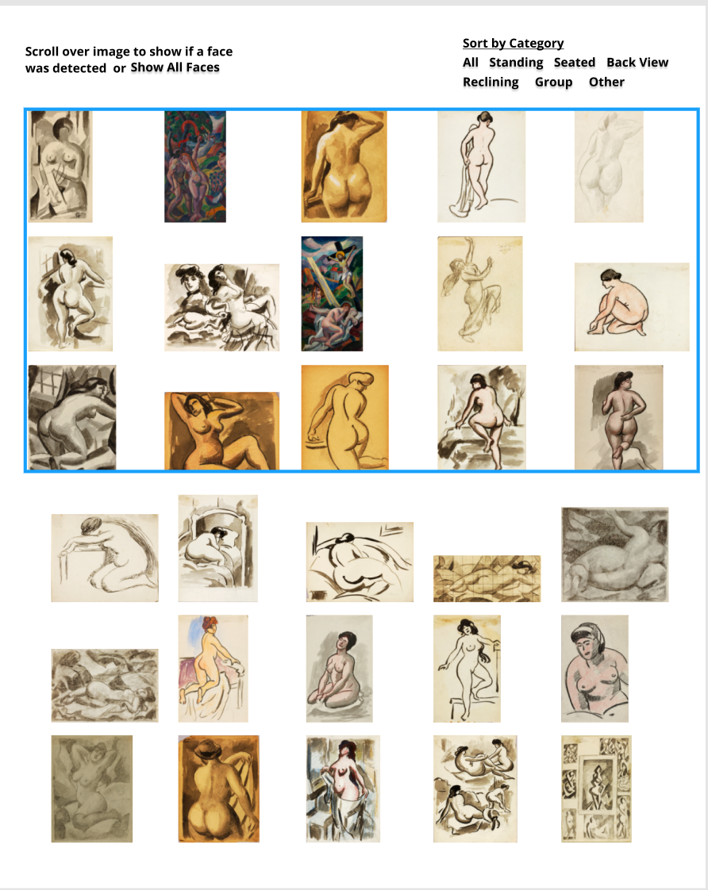
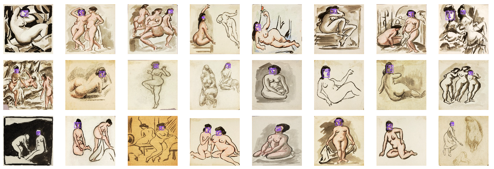

# Carl Newman's Faceless Nudes

After exploring the Smithsonian API I came across Carl Newman's collection of nudes and immediately was intrigued by how many don't have faces. For this visualization I showed the faces in a close up view to show how many are faceless.

I want to invite the viewer to think of their own reason why these nudes might not have faces while also bringing awareness to female objectivity in our everyday lives.

### Final dataset used
dataFaces.json

## Iteration 1

My first iteration of this project explored the different poses the nudes were in. I decided to move past this idea as I wanted to focus on the faces of the nudes, not their poses. I have included a snapchot of the first iteration below.

## Iteration 2

My second iteration of this project involved facial recognition to detect the faces in Carl Newman's drawings. I decided to step away from the machine learning task because the facial recognition was not accurately picking up on all of the faces in the drawings. This was probably because the software I was using was trained on human faces, not drawn faces. I have included a screen shot of the second iteration below.

## Final Iteration

For my final iteration I went in manually and seperated the nudes with faces from the nudes without faces. I then cropped only the faces to give the viewer a deeper look into how many nudes were faceless and how many were not. I then added a modal so that viewers could click each face and see the full nude it belongs to.

The final visualization can be found at https://isabelstoddart.github.io/MS1Qualitative/.
